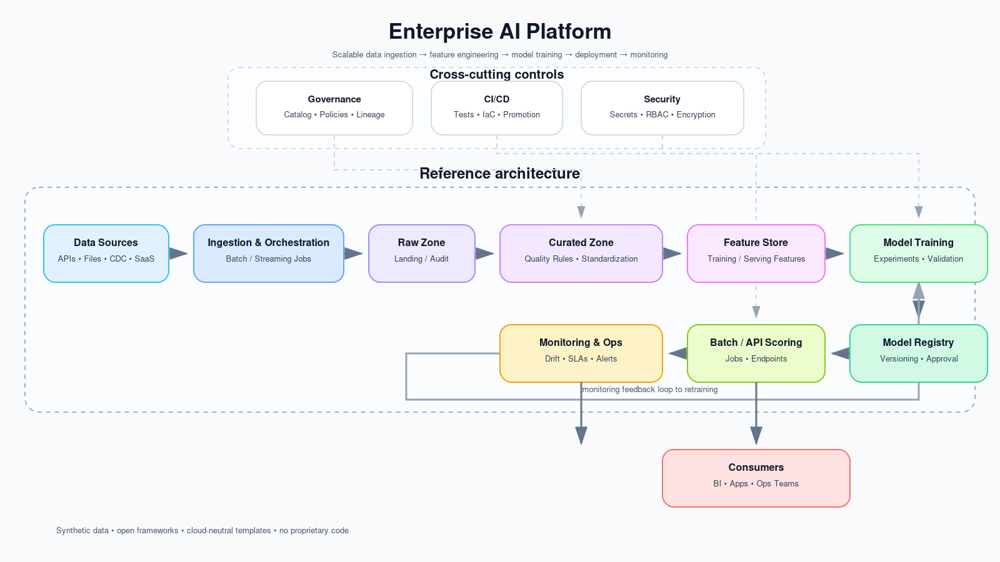

# Enterprise AI Platform

[](LICENSE)
[](https://www.python.org)
[](/.github/workflows)

---

## Executive Summary

Most AI initiatives fail not because of poor models, but because the surrounding system is not designed for scale, governance, and reuse. This repository demonstrates a production-grade enterprise AI platform blueprint that addresses the three critical challenges I've observed across 16+ years of building ML systems at scale:

1. **Platform Fragmentation:** Teams building isolated pipelines, leading to 3-5x duplicated effort
2. **Production Readiness Gap:** 70% of models never reach production due to operational complexity
3. **Governance Blind Spots:** Lack of centralized monitoring creates compliance and reliability risks

## Platform Philosophy

This is not a model repository. This is a **system design blueprint** for enterprise AI platforms that:

- Scales across multiple use cases and teams
- Integrates monitoring, governance, and reliability from day one
- Evolves from batch ML toward agentic AI architectures
- Balances innovation velocity with operational safety

**Core Principle:** Optimize for platform thinking over point solutions. One well-designed platform serving 10 teams delivers more value than 10 isolated models.

## Business Impact Framework

Based on production implementations of similar architectures:

**Platform Adoption Metrics**
- **Time to Production:** 60-70% reduction in model deployment time
- **Team Efficiency:** 5-10 teams supported per platform engineer
- **Cost Optimization:** 40-50% reduction in duplicated infrastructure spend
- **Quality Improvement:** 3x reduction in production incidents through centralized monitoring

**Organizational Benefits**
- Centralized governance for compliance and auditability
- Standardized patterns enabling team mobility and knowledge transfer
- Reduced onboarding time for new ML engineers
- Clear separation of concerns between data, ML, and platform teams

**Risk Mitigation**
- Proactive drift detection preventing model degradation
- Centralized data quality gates reducing downstream errors
- Audit trail for regulatory compliance (GDPR, SOC2, industry-specific)
- Disaster recovery and rollback capabilities

## What This Repository Demonstrates

**Production Engineering Patterns**
- End-to-end ML pipeline with clear separation of concerns
- Monitoring-first architecture (not bolted on as afterthought)
- CI/CD integration for reproducibility and testing
- Infrastructure-as-code ready design
- Extension patterns for agentic AI systems

**Enterprise Considerations**
- Multi-tenant design principles
- Cost attribution and optimization strategies
- Security and compliance frameworks
- Operational runbook patterns
- Team collaboration models

**Technical Depth**
- Batch processing with streaming evolution path
- Feature engineering with reusability patterns
- Model lifecycle management
- Observability across data, model, and system layers
- RAG and agent orchestration foundations

## Architecture



### Layered Design

**Data Layer**
- Ingestion from enterprise systems (APIs, databases, data lakes)
- Three-zone architecture: Raw → Curated → Consumption
- Data quality gates at each transition point
- Synthetic dataset included for safe reproducibility

**Processing Layer**
- ETL pipelines with validation checkpoints
- Feature engineering with versioning
- Transformation logic decoupled from business logic
- Scalable from single-node to distributed execution

**ML Lifecycle Layer**
- Training orchestration with experiment tracking patterns
- Model versioning and registry integration ready
- Evaluation framework with custom metrics support
- A/B testing and progressive rollout foundations

**Monitoring & Observability Layer**
- Data quality monitoring (completeness, validity, distribution)
- Model performance tracking (accuracy, latency, drift)
- System health metrics (pipeline success rate, resource utilization)
- Alerting and incident response patterns

**Agentic AI Extension (Future-Ready)**
- Retrieval-Augmented Generation (RAG) pipeline
- Agent orchestration patterns
- Tool-calling and workflow automation foundations
- LLM observability integration points

## Repository Structure

```
enterprise-ai-platform/
├── run_pipeline.py                     # Orchestration entry point
├── pipeline/                           # ETL, feature engineering, validation
│   ├── data_ingestion.py
│   ├── feature_engineering.py
│   └── validation.py
├── monitoring/                         # Observability components
│   ├── data_quality.py
│   ├── drift_detection.py
│   └── health_check.py
├── agents/                             # RAG + agent patterns
│   ├── rag_retrieval.py
│   └── orchestrator.py
├── models/                             # Training examples
│   └── train_model.ipynb
├── infra/                              # Infrastructure code
│   ├── terraform/
│   └── github_actions/
├── docs/                               # Architecture documentation
│   ├── SYSTEM_DESIGN.md
│   ├── DECISIONS_AND_TRADEOFFS.md
│   ├── SCALE_AND_OPERATIONS.md
│   ├── CASE_STUDY.md
│   ├── TECHNICAL_DEPTH.md
│   ├── ADOPTION_STRATEGY.md
│   └── OPERATIONAL_RUNBOOK.md
├── examples/                           # Usage examples
│   └── enterprise_run.md
├── tests/                              # Test structure
│   ├── unit/
│   └── integration/
└── data/
    └── sample_data/                    # Synthetic datasets
```

## Quick Start

### Local Execution

```bash
# Setup environment
python -m venv .venv
source .venv/bin/activate  # On Windows: .venv\Scripts\activate
pip install -r requirements.txt

# Run full pipeline
python run_pipeline.py

# Run specific components
python -m pipeline.data_ingestion
python -m monitoring.data_quality
```

### Docker Deployment

```bash
# Build image
docker build -t enterprise-ai-platform:latest .

# Run pipeline
docker run --rm \
  -v $(pwd)/data:/app/data \
  -v $(pwd)/outputs:/app/outputs \
  enterprise-ai-platform:latest

# Run with monitoring
docker run --rm \
  -e ENABLE_MONITORING=true \
  enterprise-ai-platform:latest
```

### Cloud Deployment Patterns

See `docs/SCALE_AND_OPERATIONS.md` for:
- Kubernetes deployment manifests
- Cloud-specific configurations (AWS, Azure, GCP)
- Auto-scaling strategies
- Cost optimization patterns

## Platform Capabilities

**Core Features**
- Modular and reusable pipeline components
- Declarative configuration management
- Pluggable data source connectors
- Extensible feature store pattern
- Model registry integration ready

**Operational Excellence**
- Comprehensive monitoring and alerting
- Automated data quality validation
- Drift detection and model retraining triggers
- Audit logging for compliance
- Disaster recovery mechanisms

**Developer Experience**
- Clear abstractions and interfaces
- Extensive documentation and examples
- Local development with production parity
- Fast feedback loops
- Standardized testing patterns

**Enterprise Readiness**
- Multi-tenant isolation patterns
- Role-based access control foundations
- Cost attribution and chargeback support
- Compliance framework integration
- Security scanning and secrets management

## Design Documentation

Comprehensive design artifacts demonstrating Director-level system thinking:

- **[System Design](docs/SYSTEM_DESIGN.md):** Component architecture, data flows, and integration patterns
- **[Decisions & Trade-offs](docs/DECISIONS_AND_TRADEOFFS.md):** Technology choices and architectural reasoning
- **[Scale & Operations](docs/SCALE_AND_OPERATIONS.md):** Production deployment, scaling, and operations
- **[Case Study](docs/CASE_STUDY.md):** Real-world problem, solution design, and outcomes
- **[Technical Depth](docs/TECHNICAL_DEPTH.md):** Deep-dive into complex components
- **[Adoption Strategy](docs/ADOPTION_STRATEGY.md):** Organizational rollout and change management
- **[Operational Runbook](docs/OPERATIONAL_RUNBOOK.md):** Day-2 operations and incident response

## Key Design Principles

**1. Start Simple, Scale Incrementally**
Begin with batch processing, evolve to streaming when business requires it. Avoid premature optimization while keeping scaling paths open.

**2. Monitoring is Not Optional**
Build observability into the platform from day one. What gets measured gets managed.

**3. Separation of Concerns**
Clear boundaries between data engineering, ML engineering, and platform operations enable team scalability.

**4. Design for Governance**
Compliance and auditability requirements should influence architecture, not be retrofitted later.

**5. Platform Over Projects**
Invest in reusable components that serve multiple use cases rather than one-off solutions.

**6. Progressive Disclosure**
Simple interfaces for common cases, advanced options for power users. Don't force complexity on day-one users.

## Agentic AI Evolution

This platform is designed to evolve beyond traditional ML toward agent-driven architectures:

**Current State**
- RAG-style retrieval pipeline
- Basic agent orchestration patterns
- LLM integration points

**Evolution Path**
- Tool-calling agents with external system integration
- Multi-agent collaboration workflows
- Autonomous decision systems with human-in-the-loop
- Workflow automation and task delegation
- Continuous learning and adaptation loops

This reflects the industry shift from prediction systems to action-oriented AI systems.

## Example Walkthrough

See [examples/enterprise_run.md](examples/enterprise_run.md) for a complete execution scenario demonstrating:
- Data ingestion from multiple sources
- Feature engineering pipeline
- Model training and evaluation
- Monitoring and alerting
- Agent-based workflow

## Production Lessons Learned

Insights from implementing similar platforms at scale:

**Why Batch-First Architecture**
Starting with batch processing allows teams to focus on correctness and data quality. Streaming adds operational complexity that's only justified when latency requirements demand it. 90% of enterprise ML use cases can tolerate hourly or daily batch windows.

**The Monitoring Paradox**
Teams resist investing in monitoring early because it slows initial development. But platforms without monitoring face 3-5x longer debugging cycles in production. Build monitoring first, not last.

**Feature Store Timing**
Don't build a feature store on day one. Start with versioned feature pipelines. Promote to a feature store when you have 3+ teams with overlapping feature needs. Premature feature stores become technical debt.

**The Agent Hype Curve**
Most enterprises aren't ready for fully autonomous agents. Start with human-in-the-loop patterns. Build trust through transparency and guardrails before increasing autonomy.

## Operational Metrics

Platform health indicators from production deployments:

**Pipeline Reliability**
- Target: 99.5% success rate
- Mean Time to Detection (MTTD): under 15 minutes
- Mean Time to Recovery (MTTR): under 2 hours

**Data Quality**
- Completeness checks: 100% coverage
- Validation failure rate: under 0.1%
- Data drift detection: daily monitoring

**Model Performance**
- Prediction latency: P95 under 100ms (online) or batch within SLA
- Drift detection sensitivity: configurable thresholds per use case
- Retraining trigger: automated on drift or performance degradation

**Cost Efficiency**
- Compute utilization: 70-80% target
- Storage optimization: tiered based on access patterns
- Cost per prediction: tracked and trending down

## Roadmap

**Q2 2026**
- Streaming data pipeline patterns
- Feature store integration (Feast/Tecton compatible)
- Advanced experiment tracking (MLflow/Weights & Biases)

**Q3 2026**
- Multi-tenant platform design with isolation
- LLM-native workflows and evaluation
- Advanced agent orchestration patterns

**Q4 2026**
- Real-time model serving infrastructure
- A/B testing and progressive rollout automation
- Advanced observability dashboards (Grafana/DataDog)

**2027**
- Federated learning patterns
- AutoML pipeline integration
- Platform-as-a-Service (PaaS) packaging

## Contributing

This repository is designed as a reference architecture. Contributions welcome for:
- Additional data source connectors
- Monitoring and alerting integrations
- Cloud deployment examples
- Use case specific extensions
- Documentation improvements

See [CONTRIBUTING.md](CONTRIBUTING.md) for guidelines.

## IP & Safety

- Synthetic data only (no customer or proprietary data)
- Cloud-neutral design patterns
- No enterprise-specific business logic
- Architecture and patterns are generalizable

All implementations are based on open-source technologies and publicly available best practices.

## License

MIT License - See [LICENSE](LICENSE) for details

## About the Author

**Puspanjali Sarma**  
Senior Manager (Director-level) AI Engineering | ServiceNow

**Experience:** 16+ years building production ML platforms and leading engineering teams at scale  
**Background:** ServiceNow, Rackspace, TCS, Capgemini, Tech Mahindra, Accenture  
**Published Author:** "Strategic AI Leadership Through Data" (BPB Publications)  
**Recognition:** AIM 40 Under 40 Data Scientists (India, 2025)  
**Expertise:** MLOps, GenAI, Agentic AI, Data Engineering, Platform Architecture

**Technical Leadership**
- Led 50+ member engineering teams delivering enterprise AI platforms
- Architected ML systems processing billions of records daily
- Built GenAI solutions (Test Assist, QE Assist) at ServiceNow
- Contributed to FAIR (Foundry for AI by Rackspace) platform
- Deep domain expertise in BFSI, Telecom, Enterprise SaaS

**Community Contributions**
- Conference speaker on LLM observability and AI platform engineering
- Women in Tech advisor
- GSDC Technical Advisor
- Active open-source contributor

## Connect

This repository represents production-grade platform thinking from years of building scalable AI systems. I share insights on:
- Building enterprise AI platforms that actually scale
- Bridging the gap between ML research and production operations
- Organizational patterns for successful AI adoption
- Practical strategies for agentic AI implementation

**Let's Connect:**
- **LinkedIn:** [linkedin.com/in/puspanjalisarma](https://linkedin.com/in/puspanjalisarma)
- **GitHub:** [github.com/puspanjalis](https://github.com/puspanjalis)
- **Email:** Available on LinkedIn profile

If you're building AI platforms at scale or navigating the transition from models to production systems, I'd love to exchange insights and lessons learned.

---

*This repository reflects how modern AI systems should be built: not as isolated models, but as scalable, observable, and extensible platforms designed for enterprise realities.*
