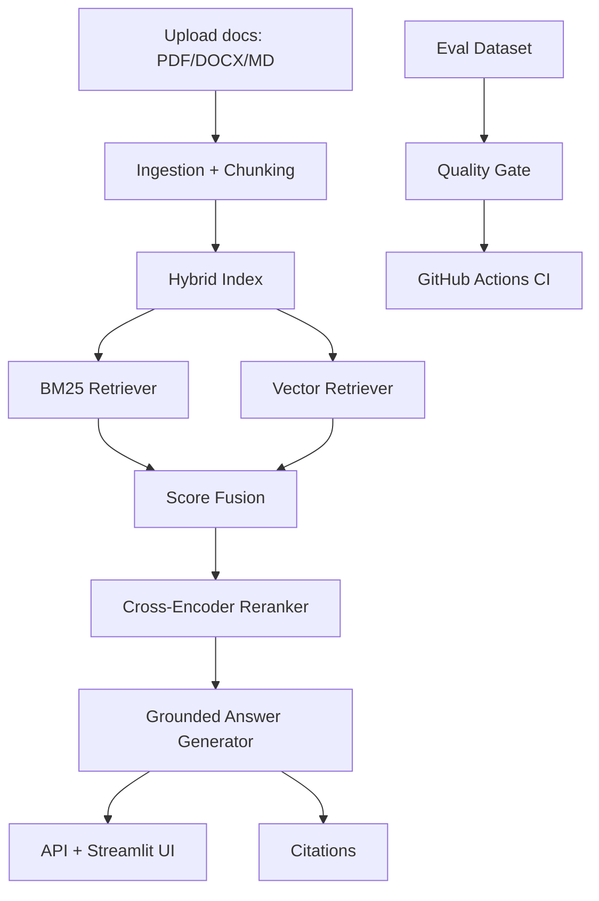

# production-rag-assistant

A production-style **Ask My Docs** RAG system with ingestion, hybrid retrieval, reranking, grounded answers with citations, and CI quality gates.

## Problem statement
Teams need a reliable way to query internal documentation without hallucinations. This project implements a domain-specific RAG pipeline that emphasizes:
- retrieval quality (hybrid lexical + semantic)
- source-grounded responses
- reproducible evaluation
- CI gating on quality regression

## Architecture diagram


## Retrieval flow
1. Parse PDFs, DOCX, markdown/text and split into overlapping chunks.
2. Retrieve with BM25 and TF-IDF vector similarity.
3. Normalize + fuse scores (weighted hybrid ranking).
4. Rerank top candidates with cross-encoder (fallback overlap model).
5. Return extractive grounded summary + citation metadata.

## Evaluation metrics
- **retrieval_recall**: whether expected source appears in citations.
- **grounded_answer_score**: whether critical expected tokens appear in answer text.

CI fails if:
- retrieval_recall < 0.80
- grounded_answer_score < 0.70

## Sample grounded answer
Question: *What is the documented incident response SLA?*

Answer includes extracted evidence and citations, e.g. `operations_handbook.md` stating mitigation starts within **4 hours** for P1 incidents.

## Failure cases and improvements
- OCR-heavy scanned PDFs can reduce extraction quality.
- Cross-encoder model download may be blocked in restricted networks (fallback scoring used).
- Improvements:
  - switch TF-IDF vectors to embedding index (FAISS/pgvector)
  - add metadata filters (doc type/team/date)
  - integrate LLM-based answer generation with strict citation verification
  - expand eval set with adversarial/no-answer queries

## Repo structure
```
production-rag-assistant/
├── app/
├── data/
├── eval/
├── ingestion/
├── retrieval/
├── api/
├── tests/
├── notebooks/
├── .github/workflows/
├── README.md
└── requirements.txt
```

## Quickstart
```bash
cd production-rag-assistant
python -m venv .venv && source .venv/bin/activate
pip install -r requirements.txt
uvicorn api.main:app --reload
```

In another terminal:
```bash
cd production-rag-assistant
streamlit run app/streamlit_app.py
```

## API
- `POST /upload` (multipart file)
- `POST /reindex`
- `POST /ask` (form field: `question`)

## Run tests and eval
```bash
cd production-rag-assistant
pytest -q
python eval/run_eval.py
```
